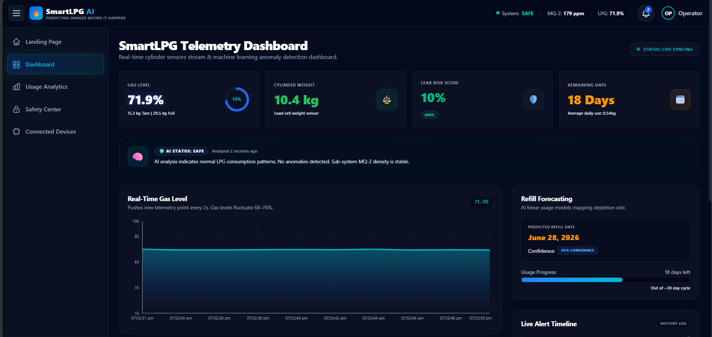

# 🔥 AI-Powered Smart LPG Monitoring & Safety System

An intelligent IoT-based LPG monitoring platform that helps users monitor gas levels, predict leaks, receive instant alerts, and forecast refill requirements using AI-powered analytics.

## 🚀 Live Demo

🌐 **Demo:** https://your-netlify-link.netlify.app

## 📌 Features

- 📊 Real-Time LPG Level Monitoring
- 🤖 AI-Based Leak Prediction
- ⚠️ Instant Safety Alerts
- 📈 Gas Usage Analytics
- 🔮 Smart Refill Forecasting
- 📱 Responsive Dashboard UI
- 🎯 Risk Assessment & Safety Status
- 🌐 Modern IoT Monitoring Interface

## 🛠️ Tech Stack

### Frontend
- React.js
- Vite
- CSS3
- Recharts

### Tools
- Git
- GitHub
- Netlify

## 📷 Screenshots




## 📂 Project Structure

```bash
src/
├── assets/
├── App.jsx
├── App.css
├── index.css
├── main.jsx

public/

package.json
vite.config.js
```


## 🎯 Use Cases

- Smart Homes
- Apartments
- Commercial Kitchens
- Hotels & Restaurants
- LPG Service Providers
- Industrial Safety Monitoring

## 🔮 Future Enhancements

- IoT Sensor Integration
- Mobile Application
- SMS & Email Alerts
- Cloud Data Storage
- Advanced AI Models
- Emergency Response System

## 👨‍💻 Author

**DeenPrasath**

GitHub: https://github.com/Deenprasath

## ⭐ Support

If you found this project useful, please give it a ⭐ on GitHub.
